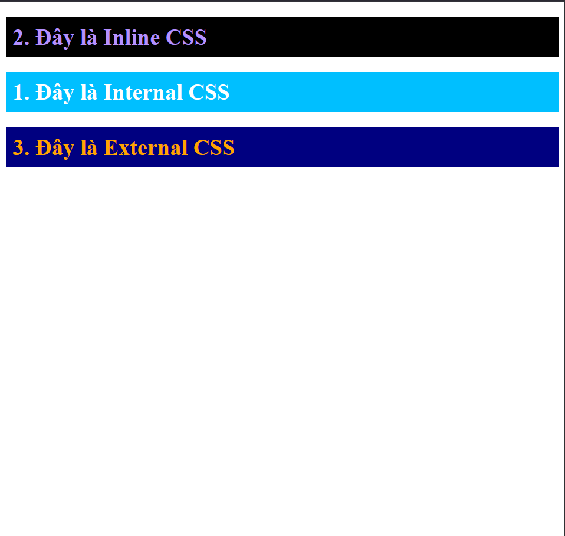
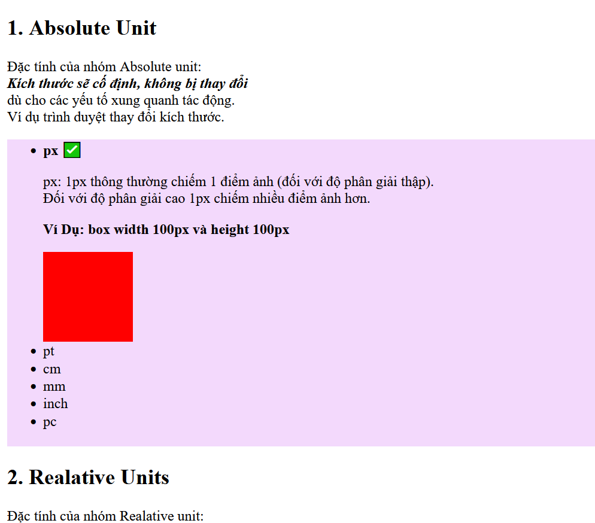

<table style="border-collapse: collapse;">
  <tr>
    <td style="padding: 5px; border: 1px solid #ccc;">
      
    </td>
    <td style="padding: 5px; border: 1px solid #ccc;">
      
    </td>
  </tr>
  <tr>
    <td style="padding: 5px; border: 1px solid #ccc;">
      
    </td>
    <td style="padding: 5px; border: 1px solid #ccc;">
      
    </td>
  </tr>
  <tr>
    <td style="padding: 5px; border: 1px solid #ccc;">
      
    </td>
    <td style="padding: 5px; border: 1px solid #ccc;">
      
    </td>
  </tr>
  <tr>
    <td style="padding: 5px; border: 1px solid #ccc;">
      
    </td>
    <td style="padding: 5px; border: 1px solid #ccc;">
      
    </td>
  </tr>
  <tr>
    <td style="padding: 5px; border: 1px solid #ccc;">
      
    </td>
    <td style="padding: 5px; border: 1px solid #ccc;">
      
    </td>
  </tr>
  <tr>
    <td style="padding: 5px; border: 1px solid #ccc;">
      
    </td>
    <td style="padding: 5px; border: 1px solid #ccc;">
      
    </td>
  </tr>
  <tr>
    <td style="padding: 5px; border: 1px solid #ccc;">
      
    </td>
    <td style="padding: 5px; border: 1px solid #ccc;">
      
    </td>
  </tr>
  <tr>
    <td style="padding: 5px; border: 1px solid #ccc;">
      
    </td>
    <td style="padding: 5px; border: 1px solid #ccc;">
      
    </td>
  </tr>
</table>
